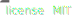
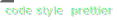

# [🥣 Sosse](https://github.com/sossejs/sosse)

---

Spice your servers up with a lil Sosse

Usage examples can be found in the [Getting started](https://github.com/sossejs/sosse/blob/master/docs/getting_started.md) section.

## Features:

- 🔥 Hot server restart
- 🔄 Live reload
- 🖨 Outputs server errors in browser
- ⚛️ Interactive (p)react components
- 🌊 Css Serverside Rendering with [Otion](https://github.com/kripod/otion)
- 📦 Bundling client assets with [Microbundle](https://github.com/developit/microbundle)
