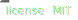

# [🥣 Sosse](https://github.com/sossejs/sosse)

---

Spice your servers up with a lil Sosse

## Features:

- 🔥 Hot server restart
- 🔄 Live reload
- 🖨 Outputs server errors in browser

## Planned:

- 🌊 Css Serverside Rendering with [Otion](https://github.com/kripod/otion)
- 📦 Bundling client assets with [Microbundle](https://github.com/developit/microbundle)
